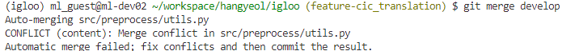
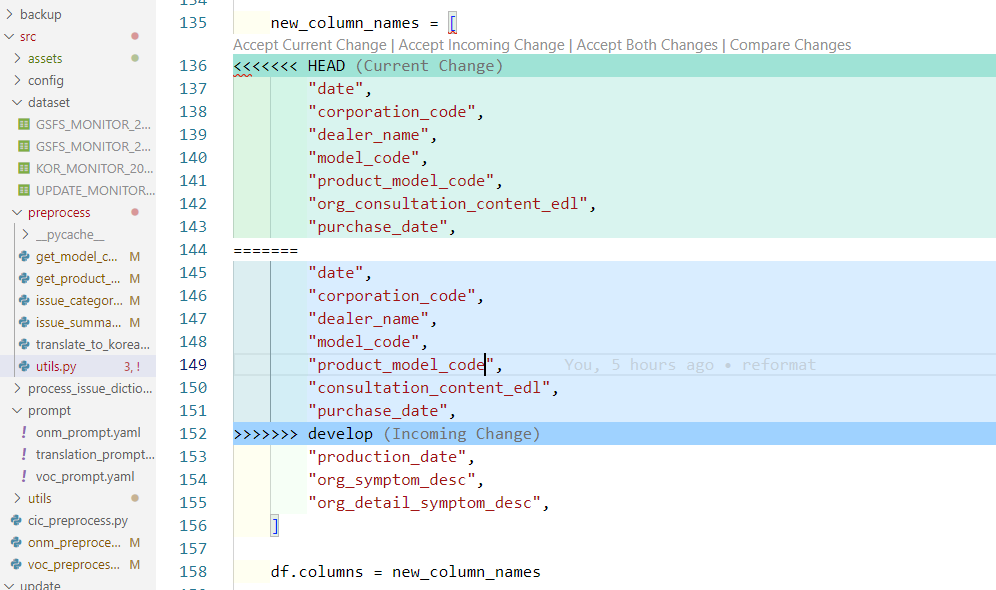
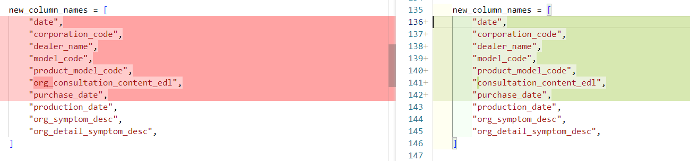

## git merge conflict 해결법

### 1. 상황 설명
* **A branch**에서 내가 작업해서 코드를 수정했고,
* **B branch**에서 다른 사람이 작업해서 코드를 수정했음
* 코드 동기화를 위해 **B branch**의 코드를 ---> 내가 작업 중인 **A branch**에 합치려고 하고, **git merge B**를 한 상황!
* merge가 완료 되었는데, 서로 수정한 부분이 겹쳐서 일부 파일에서 **git merge conflict**가 발생했을 때 대처법

### 2. 문제 결과 

* CLI에서 보여지는 것: 현재 utils.py에서 충돌이 났음을 의미

* 충돌이 발생한 파일에서 보여지는 것
   * HEAD: 내가 작업한 **A branch**에서 수정한 부분
   * Incoming Change: 병합 대상이 되는 **B branch**에서 수정한 부분
   

* 더 자세히
   * 좌측: HEAD, 우측: Incoming Change

### 3. 해결 방법
1. 우선 어떤 걸 기준으로 합칠지 정해야 함
   * Accept Current Change: HEAD 부분을 기준으로 합침 (내가 수정한 부분)
   * Accept Incoming Change: 병합 대상이 되는 branch에서 수정한 부분을 기준으로 합침
   * Accept Both Change: HEAD와 병합 대상이 되는 부분 둘 다 남김
   * Compare Change: conflict 발생한 부분을 더 보기 쉽게 보여줌

2. 합친 다음, **A branch**에서 `git add`

3. `git commit -m "메시지"`

4. 이러면 충돌났던 부분이 자동으로 merge가 됨